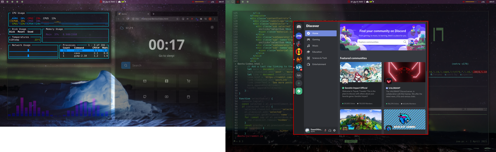

# dotfiles

Config files versioned with git and managed by [GNU
stow](https://www.gnu.org/software/stow/).

## TL;DR
* **WM**: [i3-gaps](https://github.com/Airblader/i3) (multi-monitor setups) / [i3](https://i3wm.org/) (laptops)
* **Bar**: [Polybar](https://github.com/polybar/polybar)
* **Launchers**: [Rofi
  1.6.1-34-g53533acb](https://github.com/davatorium/rofi/tree/1.6.1) (from
  rofi-git on Manjaro, from source on Debian)
* **Terminal**: [xfce4-terminal](https://helpmanual.io/help/xfce4-terminal/)
* **Multiplexer**: [tmux](https://github.com/tmux/tmux/wiki)
* **Editor**: [vim](https://www.vim.org/)
* **Compositor**:
  * [Picom 7.5](https://github.com/yshui/picom) on Manjaro
  * [tryone144/compton](https://github.com/tryone144/compton) on Debian

### Optional
* [**Krita**](https://krita.org/en/): FOSS paint program `sudo pacman -S krita`
* **Wacom Driver**: [xsetwacom](https://github.com/linuxwacom/xf86-input-wacom/wiki/xsetwacom)
  from [xf86-input-wacom](https://archlinux.org/packages/extra/x86_64/xf86-input-wacom/)
* **Messaging Platforms**: [WhatsApp](https://wiki.archlinux.org/index.php/WhatsApp)
  nativefier-dark and [Discord](https://wiki.archlinux.org/index.php/Discord)
* **Notifications**: [dunst](https://dunst-project.org/) (can also use default
  daemon)
* **System Monitoring**: [gotop](https://github.com/cjbassi/gotop)
  (AUR on Manjaro or source for Debian)
* **Media**: [mpd](https://wiki.archlinux.org/index.php/Music_Player_Daemon),
  [ncmpcpp](https://wiki.archlinux.org/index.php/ncmpcpp), and
  [cava](https://github.com/karlstav/cava)
* **Lock Screen**: [Lixxia/i3lock](https://github.com/Lixxia/i3lock)
* [**Grip**](https://github.com/joeyespo/grip): `pip install grip`
* [**QMK**](https://github.com/qmk/qmk_firmware) keyboard firmware
* [**jq**](https://stedolan.github.io/jq/) for JSON parsing

### Other prerequisites
* `suckless-tools` (for i3 on Debian)
* `feh`
* `xdotool`
* `bindkeys`
* `xautomation`
* [`gsimplecal`](https://archlinux.org/packages/community/x86_64/gsimplecal/)
* `gucharmap`

## Notes to the future me
NOTE: if an existing file already exists, `stow` will **not** overwrite it.
```
git clone https://github.com/zskendall/dotfiles
~/dotfiles/install.sh
cd ~/dotfiles && stow dunst i3 media polybar rofi tmux vim xsession && cd ~
xrdb -merge ~/.Xresources
sed "s~%music_dir%~<music_dir_here>~" ~/.config/mpd/template > ~/.config/mpd/mpd.conf
sed "s~%music_dir%~<music_dir_here>~" ~/.ncmpcpp/template > ~/.ncmpcpp/config
./.xprofile
```
Since I've never clean installed after creating, might need to install git
and/or `chmod u+x` the script.

More information is in subdirs :)
