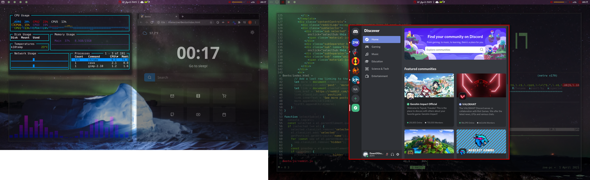

# dotfiles

Config and infrastructure for small productivity homelab and PCs, all
running debian stable

## TL;DR
```
git clone https://github.com/zskendall/dotfiles.git
~/dotfiles/setup.sh [server|graphical]
```
**prerequisites**: git, ssh. servers expect one-time tailscale authkey at
`/tmp/ts-authkey`. script handles everything else, including package
installation, tailscale installation and setup,
[GNU stow](https://www.gnu.org/software/stow/) of files, and starting containers

## system-level
infra machines run `unattended-upgrades` for security patches:
```
sudo vim /etc/apt/apt.conf.d/50unattended-upgrades  # to set origins and reboot
```

## Notes to the future me
NOTE: if an existing file already exists, `stow` will **not** overwrite it.

[Load older Krita brushes: Settings > Manage Resource Libraries > Activate
Krita_3_Default...](https://www.reddit.com/r/krita/comments/stpd1v/importing_krita_3_brushes/?rdt=33734)

If unable to open iOS HEIC files, might need to update `libheif`:
```
sudo add-apt-repository ppa:ubuntuhandbook1/libheif
sudo apt update && sudo apt upgrade
sudo apt install libheif-plugin-libde265 libheif-plugin-aomenc
sudo apt install libgd3 libheif1
```
