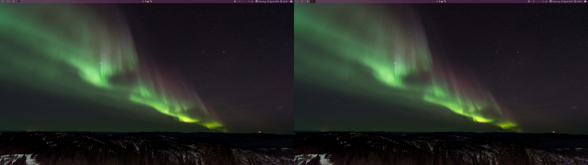

# Polybar Config for Custom Statusbar

*Default Polybar on dual monitors*

[Photo by FORREST CAVALE on Unsplash](https://unsplash.com/photos/jwIk4Z3Msi4)

## Installation Notes
For Debian or Ubuntu, will need to follow instructions to build from [source](https://github.com/jaagr/polybar).

[Wiki with deps for a few different distros](https://github.com/jaagr/polybar/wiki/Compiling)

[Error 2 when attempting to build cxx object bar.cpp.o](https://github.com/jaagr/polybar/issues/644)
that happened when `sudo make install` run on laptop.  
**TLDR** xcb-proto and libxcb-randr0-dev need to be the same version.

Other sources that list deps: 
[[1]](https://medium.com/@tatianaensslin/install-polybar-in-3-steps-on-debian-stretch-c64ab6157fb1)
[[2]](https://github.com/jaagr/polybar/issues/650)
[[3]](https://github.com/jaagr/polybar/issues/367)
