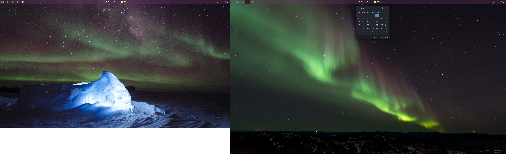

# Polybar Config for Custom Statusbar


[Photo creds](../../../images/README.md)

## Installation Notes
```
sudo apt install polybar gsimplecal
```
Or build from [source](https://github.com/jaagr/polybar).

### Dependencies
[Wiki with deps for a few different distros](https://github.com/jaagr/polybar/wiki/Compiling)  
Combined paste-friendly command for apt (required and optional):
```
sudo apt-get install build-essential git cmake cmake-data pkg-config \
  python3-sphinx libcairo2-dev libxcb1-dev libxcb-util0-dev libxcb-randr0-dev \
  libxcb-composite0-dev python-xcbgen xcb-proto libxcb-image0-dev \
  libxcb-ewmh-dev libxcb-icccm4-dev libxcb-xkb-dev libxcb-cursor-dev \
  libasound2-dev libpulse-dev i3-wm libjsoncpp-dev libmpdclient-dev \
  libcurl4-openssl-dev libnl-genl-3-dev
```

Other sources that list deps: 
[[1]](https://medium.com/@tatianaensslin/install-polybar-in-3-steps-on-debian-stretch-c64ab6157fb1)
[[2]](https://github.com/jaagr/polybar/issues/650)
[[3]](https://github.com/jaagr/polybar/issues/367)

### Experienced Issues and Fixes
Most of the fixes were found from resolved issues filed.
1. `sudo make install` did not work on laptop around 9%  
    1. Stack trace shows error from an initializer in a dep library.
    1. Check gcc version: `gcc -v`
    1. May need to `sudo apt-get install g++`
1. `sudo make install` did not work on laptop around 20%  
    1. [Error 2 when attempting to build cxx object bar.cpp.o](https://github.com/jaagr/polybar/issues/644)  
   **TLDR** xcb-proto and libxcb-randr0-dev need to be the same version.

## Other Notes
### RGBA wasn't using the A value:
1. Double-check compton (as it wasn't running on re-login)
1. Update polybar by uninstalling and downloading newest version from
  [release page](https://github.com/jaagr/polybar/releases); to uninstall:  
```
cd ~/polybar/build
sudo make uninstall
```
