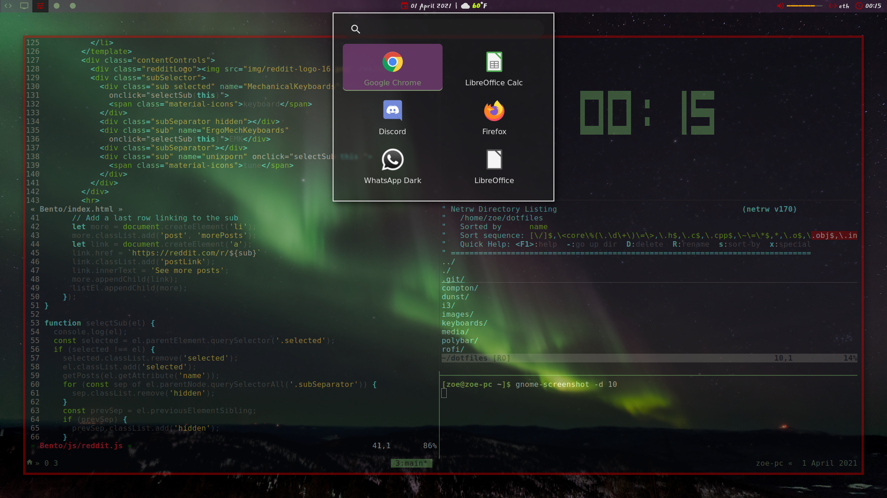
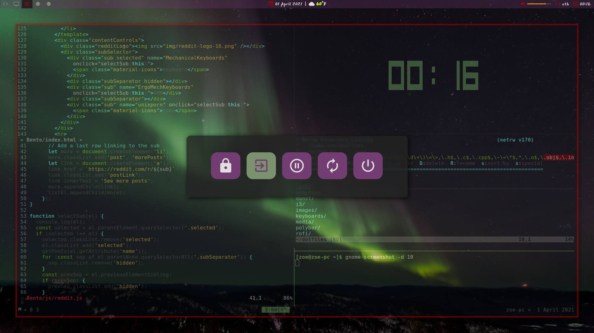

# Rofi launchers
Key maps are in .Xresources while themes are in separate `.rasi` files that can
be specified with `-theme <theme>` in i3 config bindsym.

Uses [Rofi 1.6.1-34-g53533acb](https://github.com/davatorium/rofi/tree/1.6.1).

## Launcher


## System menu


## Installation
### Manjaro
Available in the `rofi-git` AUR package, but if it's been updated by next
install, can view previous versions
[here](https://aur.archlinux.org/cgit/aur.git/log/?h=rofi-git)

```
sudo pamac build rofi-git
rofi -V
stow rofi
xrdb -merge ~/.Xresources
```

### Debian
If the version isn't in apt yet,
[build](https://github.com/davatorium/rofi/blob/next/INSTALL.md) from source;
```
git clone https://github.com/davatorium/rofi.git
cd rofi
git submodule update --init
autoreconf -i
mkdir build && cd build
../configure
make
sudo make install
rofi -V
```
